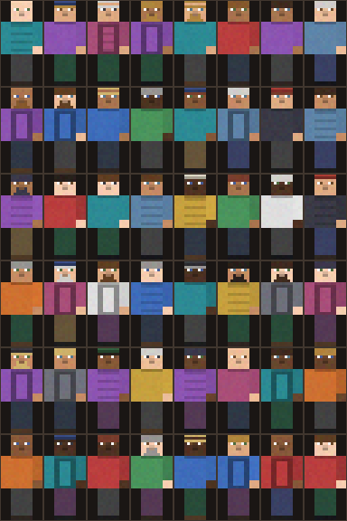

# Чердак Бессмертных

[](https://github.com/cherdakmd/chrdk_for_subscribers/actions/workflows/build.yml)

Мод для **Minecraft 26.3 (Fabric)**, который увековечивает подписчиков канала в мире выживания.
Не мраморный храм олимпийцев, а пыльный чердак: постаменты, латунь, свечи, старая бумага — и имена.

**Готовый jar:** [Releases → Последний релиз](https://github.com/cherdakmd/chrdk_for_subscribers/releases/latest) (`chrdk_pantheon-*.jar`).

Концепт целиком: [DESIGN.md](DESIGN.md).

## Что уже работает

### Ритуал чердака

1. Смастери **Пустую печать** (бумага + чернильный мешок + золотой самородок).
2. Переименуй её в **наковальне** в ник подписчика — печать «подписывается» именем.
   (или `/attic seal <ник>` — выдаст готовую печать)
3. Щёлкни печатью по **Постаменту подписчика** — печать впечатывается, и на постаменте
   встаёт **фигурка подписчика**: настоящая 3D-модель игрока со своим скином.
4. **Shift + правый клик** по занятому постаменту — фигурку можно снять, печать с именем вернётся в руки.
5. Обычный правый клик — рассказать, кто стоит на постаменте (тир, дата, источник).

### Фигурки подписчиков (v0.2)



* Если ник подписчика — **настоящий майнкрафт-аккаунт**, на постаменте стоит его скин
  (включая модель рук Alex/Steve) — берётся из ванильного кэша скинов, мод не ходит в сеть сам.
* Если аккаунта нет — подставляется **процедурный аватар**: один из 48 сгенерированных скинов,
  выбранный по нику. Для одного и того же имени он всегда одинаковый.
* Размер фигурки зависит от **тира** подписчика (`/attic tier <ник> 1..5`): от небольшой статуэтки
  до фигуры почти в человеческий рост.
* Фигурка разворачивается туда, куда смотрел игрок при установке постамента.

Превью всех 48 аватаров: [docs/figurine_skins.png](docs/figurine_skins.png).

### Остальное

* **Чердачный алтарь** — правый клик показывает сводку: сколько подписчиков на полках и кто пришёл последним.
* **Свиток Имён** — носимый список: правый клик читает летопись в чат (бумага ×2 + чернильный мешок + золотой самородок).
* **Команды** `/attic` (он же `/чердак`):

| Команда | Что делает |
|---|---|
| `list [стр.]` | летопись постранично |
| `add <ник>` | вписать имя в летопись без постамента |
| `remove <ник>` | вычеркнуть имя |
| `tier <ник> <1..5>` | задать «тир» подписчика (размер фигурки) |
| `seal <ник>` | выдать именную печать |
| `scroll` | выдать Свиток Имён |
| `stats` | сводка |

Летопись хранится **внутри мира** (`SavedData`), так что в одиночной игре работает без сервера:
мир можно копировать, бэкапить и переносить вместе с именами.

## Как собрать

Мод собирается **на GitHub Actions** — workflow [`.github/workflows/build.yml`](.github/workflows/build.yml)
прогоняется на каждый push и кладёт `chrdk_pantheon-<версия>.jar` в артефакты (`build/libs/`).

Как выпустить новый релиз: подними `version` в `gradle.properties`, затем

```bash
git tag -a v0.3.0 -m "Чердак Бессмертных v0.3.0" && git push origin v0.3.0
```

CI соберёт jar и сам создаст GitHub Release с заметками и приложенным модом.

Локально (нужен JDK 25):

```bash
./gradlew build        # jar появится в build/libs/
./gradlew runClient    # запустить клиент с модом
```

## Установка

1. Minecraft 26.3 + [Fabric Loader](https://fabricmc.net/use/installer/) 0.19.5+
2. В `mods/` положить jar мода и [Fabric API](https://modrinth.com/mod/fabric-api) для 26.3
3. Мод нужен и на клиенте, и на сервере: фигурки рисует клиент.

## Стек

Minecraft 26.3 · Fabric Loader 0.19.5 · Fabric API 0.161.0+26.3 · Java 25 · Gradle 9.7.1 · Loom 1.18-SNAPSHOT ·
официальные маппинги Mojang (в Fabric API 26.3 Yarn больше не используется).

Текстуры, скины и иконка рисуются скриптом `tools/make_textures.py` (Pillow) — можно пересобрать одной командой.

В `docs/api/` лежит снятый через `javap` справочник сигнатур классов Minecraft 26.3 (рендер моделей,
скины игроков, `PoseStack` и т.п.) — обновляется workflow `diag.yml` и помогает не угадывать API.

## Дальше (см. DESIGN.md)

* **v0.3** — импорт списков подписчиков из файла (выгрузки YouTube/Twitch/Boosty), сундук подписчика, декор-сет чердака.
* **v0.4** — Аура Пантеона (баффы от числа фигурок у алтаря), ниши подношений, вехи-монументы.
* **v0.5** — «мост» для эфира: подписка на стриме → фигурка материализуется в мире в реальном времени.
