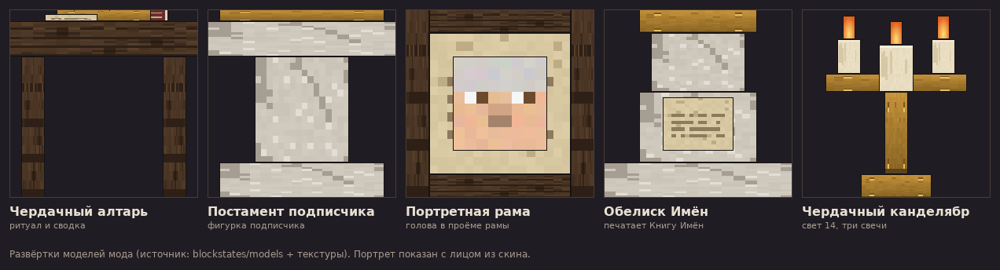
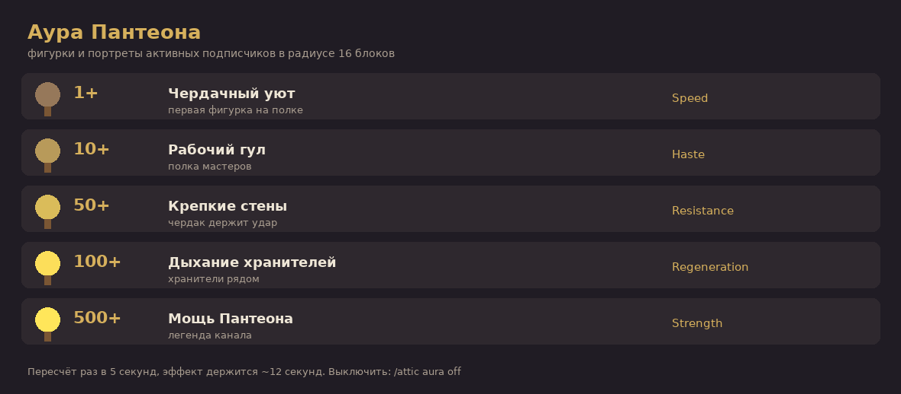
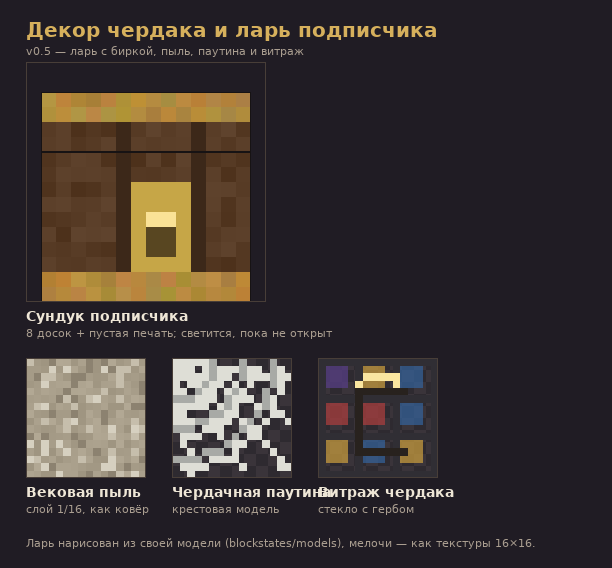

# Чердак Бессмертных

[](https://github.com/cherdakmd/chrdk_for_subscribers/actions/workflows/build.yml)

Мод для **Minecraft 26.3 (Fabric)**, который увековечивает подписчиков канала в мире выживания.
Не мраморный храм олимпийцев, а пыльный чердак: постаменты, латунь, свечи, старая бумага — и имена.

**Готовый jar:** [Releases → Последний релиз](https://github.com/cherdakmd/chrdk_for_subscribers/releases/latest) (`chrdk_pantheon-*.jar`).

Концепт целиком: [DESIGN.md](DESIGN.md).

## Что уже работает

### Ритуал чердака

1. Смастери **Пустую печать** (бумага + чернильный мешок + золотой самородок).
2. Переименуй её в **наковальне** в ник подписчика — печать «подписывается» именем.
   (или `/attic seal <ник>` — выдаст готовую печать)
3. Щёлкни печатью по **Постаменту подписчика** (или по **Портретной раме**) — печать впечатывается,
   на постаменте встаёт **фигурка подписчика** (настоящая 3D-модель игрока со своим скином),
   а в раме загорается **его портрет**.
4. **Shift + правый клик** по занятому святилищу — фигурку/портрет можно снять, печать с именем вернётся в руки.
5. Обычный правый клик — рассказать, кто здесь увековечен (тир, дата, источник).

### Фигурки подписчиков (v0.2)


* Если ник подписчика — **настоящий майнкрафт-аккаунт**, на постаменте стоит его скин
  (включая модель рук Alex/Steve) — берётся из ванильного кэша скинов, мод не ходит в сеть сам.
* Если аккаунта нет — подставляется **процедурный аватар**: один из 48 сгенерированных скинов,
  выбранный по нику. Для одного и того же имени он всегда одинаковый.
* Размер фигурки зависит от **тира** подписчика (`/attic tier <ник> 1..5`): от небольшой статуэтки
  до фигуры почти в человеческий рост.
* Фигурка разворачивается туда, куда смотрел игрок при установке постамента.

Превью всех 48 аватаров: [docs/figurine_skins.png](docs/figurine_skins.png).

### Обелиск Имён, Книга Имён и свет (v0.3)



* **Обелиск Имён** — каменный столп-каталог. Правый клик: сводка по чердаку, последние пришедшие
  и **Книга Имён** в руки.
* **Книга Имён** — обычная писаная книга со всей летописью: первая страница со сводкой и первыми именами,
  дальше список с тирами и пометкой потухших (†). Такую книгу можно листать, положить в сундук или подарить;
  перепечатать — снова щёлкнуть по обелиску или `/attic book`.
* **Портретная рама** — место подписчика на стене: в проёме рамы висит **голова подписчика**
  (настоящий скин или процедурный аватар). Поворачивается на игрока при установке; ритуал печати тот же,
  что у постамента.
* **Чердачный канделябр** — латунный светильник на три свечи (свет 14) с дымком. Им и освещают чердак.

### Аура, дары и вехи (v0.4)



* **Аура Пантеона** — фигурки и портреты *активных* подписчиков в радиусе 16 блоков поддерживают игрока:

| Фигурок рядом | Ступень | Эффект |
|---|---|---|
| 1+ | Чердачный уют | Speed |
| 10+ | Рабочий гул | Haste |
| 50+ | Крепкие стены | Resistance |
| 100+ | Дыхание хранителей | Regeneration |
| 500+ | Мощь Пантеона | Strength |

Пересчёт раз в 5 секунд, эффект держится ~12 секунд, ступень сообщается в чате при входе в ауру.
Выключается командой `/attic aura off` (для тех, кто не хочет баффов).
С v0.6 аура считает тиры: фигурка или портрет тира N даёт N очков вместо одного.

* **Подношения** — правый клик любым предметом по занятому святилищу: подписчик принимает дар
  и благодарит подарком по своему тиру (бумага и золотые самородки на первом тире, изумруды,
  алмазы и золотые яблоки — на пятом). На каждое святилище — раз в игровой день; сколько даров
  уже принесено, показывает правый клик по святилищу и Книга Имён.
* **Вехи** — 1 / 10 / 50 / 100 / 500 / 1000 имён: чердак отмечает рубеж (звон, искры, сообщение всем)
  и записывает дату в летопись. Последняя страница Книги Имён — вехи и самые обласканные дарами подписчики.
* **Импорт и экспорт** — `/attic export` кладёт летопись в `config/chrdk_pantheon/subscribers.txt`
  (`ник,тир,источник`), `/attic import` вписывает всех из файла разом: удобно заливать выгрузку подписчиков
  из YouTube Studio / Twitch / Boosty, просто скопировав ники в файл.

### Ларь, декор и каталог в чате (v0.5)



* **Сундук подписчика** — личный ларь на 27 слотов с биркой. Щёлкни именной печатью — ларь подписан,
  а внутри лежит **приветственный подарок** по тиру. Пока ларь не открывали, он подсвечивается изнутри.
  Содержимое выпадает, если ларь снести.
* **Декор чердака**: **Вековая пыль** (слой в 1/16 блока, как ковёр), **Чердачная паутина**
  (крестовая модель — как ванильная паутина) и **Витраж чердака** — цветное стекло с гербом канала.
* **Каталог в чате** — обелиск и `/attic list` дают список **кликабельных имён**; клик открывает карточку:

| Кнопка в карточке | Что делает |
|---|---|
| `1`…`5` | поставить тир подписчика |
| `[выдать печать]` | печать с этим именем — для постамента, рамы или ларя |
| `[потушить]` / `[вернуть в строй]` | отписавшийся гаснет, но остаётся в истории |
| `[к списку]` | вернуться к летописи |

### Ритуальный крафт фигурок (v0.6)

* **Фигурка подписчика — предмет.** Она хранит ник и тир: тир виден в подсказке предмета,
  а снятие фигурки с постамента возвращает её с тем же тиром.
* **Отливка в верстаке.** Именная печать + свеча + золотой слиток + бумага → фигурка подписчика.
  Имя с печати переносится на фигурку, тир — первый. Печать при отливке расходуется.
* **Установка.** Фигурка водружается только на **Постамент подписчика**: имя попадает в летопись,
  а если подписчик уже в летописи — его тир повышается до тира фигурки (запись не дублируется).
  Shift + правый клик снимает фигурку и возвращает её с ником и тиром; с портретной рамы и ларя
  снятие возвращает именную печать.
* **Возвышение у алтаря.** Возьми две одинаковые фигурки одного ника и тира (в две руки) и щёлкни
  по **Чердачному алтарю** — фигурки соединяются в фигурку тира выше, если в инвентаре хватает
  ритуальных ресурсов:

  | Тир | Ресурсы |
  |---|---|
  | 1 → 2 | 4 железных слитка |
  | 2 → 3 | 2 алмаза |
  | 3 → 4 | 1 слиток незерита |
  | 4 → 5 | звезда Незера + дыхание дракона + 4 золотых слитка |

* **Понижение.** **Чердачный резец** (крафт: палка + железный слиток) через наковальню:
  фигурка в одной руке, резец в другой, правый клик по наковальне — тир фигурки ниже на один.
* **Аура считает тиры.** Фигурка или портрет тира N даёт N очков ауры вместо одного.
* Новая команда `/attic figurine <ник> [тир]` и кнопка «[выдать фигурку]» в карточке подписчика
  (клик по имени в `/attic list`).

### Остальное

* **Чердачный алтарь** — правый клик показывает сводку: сколько подписчиков на полках и кто пришёл последним.
* **Свиток Имён** — носимый список: правый клик читает летопись в чат (бумага ×2 + чернильный мешок + золотой самородок).
* **Команды** `/attic` (он же `/чердак`):

| Команда | Что делает |
|---|---|
| `list [стр.]` | летопись постранично |
| `add <ник>` | вписать имя в летопись без постамента |
| `remove <ник>` | вычеркнуть имя |
| `tier <ник> <1..5>` | задать «тир» подписчика (размер фигурки) |
| `seal <ник>` | выдать именную печать |
| `figurine <ник> [тир]` | выдать фигурку подписчика (тир 1..5) |
| `scroll` | выдать Свиток Имён |
| `book` | выдать (перепечатать) Книгу Имён со всей летописью |
| `info <ник>` | карточка подписчика с кнопками (тир, печать, потушить) |
| `find <текст>` | поиск по летописи |
| `top [N]` | кто больше всех обласкан дарами |
| `toggle <ник>` | вернуть в строй / потушить фигурку |
| `aura [on\|off]` | состояние ауры, ступени и сколько фигурок рядом (или включить/выключить) |
| `import [файл]` | вписать всех подписчиков из `config/chrdk_pantheon/subscribers.txt` |
| `export` | выгрузить летопись в тот же файл для правки в блокноте |
| `stats` | сводка |

Блоки мода: Чердачный алтарь, Постамент подписчика, Портретная рама, Обелиск Имён, Чердачный канделябр,
**Сундук подписчика**, **Вековая пыль**, **Чердачная паутина**, **Витраж чердака** — все с рецептами
и своей вкладкой креатива «Чердак Бессмертных». Предметы: **Пустая печать**, **Свиток Имён**,
**Фигурка подписчика**, **Чердачный резец**.

Летопись хранится **внутри мира** (`SavedData`), так что в одиночной игре работает без сервера:
мир можно копировать, бэкапить и переносить вместе с именами.

## Как собрать

Мод собирается **на GitHub Actions** — workflow [`.github/workflows/build.yml`](.github/workflows/build.yml)
прогоняется на каждый push и кладёт `chrdk_pantheon-<версия>.jar` в артефакты (`build/libs/`).

Как выпустить новый релиз: подними `version` в `gradle.properties`, затем

```bash
git tag -a v0.3.0 -m "Чердак Бессмертных v0.3.0" && git push origin v0.3.0
```

CI соберёт jar и сам создаст GitHub Release с заметками и приложенным модом.

Локально (нужен JDK 25):

```bash
./gradlew build        # jar появится в build/libs/
./gradlew runClient    # запустить клиент с модом
```

## Установка

1. Minecraft 26.3 + [Fabric Loader](https://fabricmc.net/use/installer/) 0.19.5+
2. В `mods/` положить jar мода и [Fabric API](https://modrinth.com/mod/fabric-api) для 26.3
3. Мод нужен и на клиенте, и на сервере: фигурки рисует клиент.

## Стек

Minecraft 26.3 · Fabric Loader 0.19.5 · Fabric API 0.161.0+26.3 · Java 25 · Gradle 9.7.1 · Loom 1.18-SNAPSHOT ·
официальные маппинги Mojang (в Fabric API 26.3 Yarn больше не используется).

Текстуры, скины и иконка рисуются скриптом `tools/make_textures.py` (Pillow) — можно пересобрать одной командой.
Превью блоков (`docs/attic_blocks.png`) рисует `tools/render_models.py` прямо из JSON-моделей и текстур,
схему ступеней ауры (`docs/aura_ladder.png`) — `tools/aura_sheet.py`,
превью декора (`docs/attic_decor.png`) — `tools/decor_sheet.py`.

В `docs/api/` лежит снятый через `javap` справочник сигнатур классов Minecraft 26.3 (рендер моделей,
скины игроков, `PoseStack` и т.п.) — обновляется workflow `diag.yml` и помогает не угадывать API.

## Дальше (см. DESIGN.md)

* **v0.6** — «ритуальный крафт»: фигурка подписчика — предмет, который отливается в верстаке
  из именной печати, свечей, золота и бумаги, а потом ставится на постамент.
* **далее** — Хранители (оживают в рейде), реликвии и знамёна, монументы-вехи в мире, экран-каталог у обелиска.
